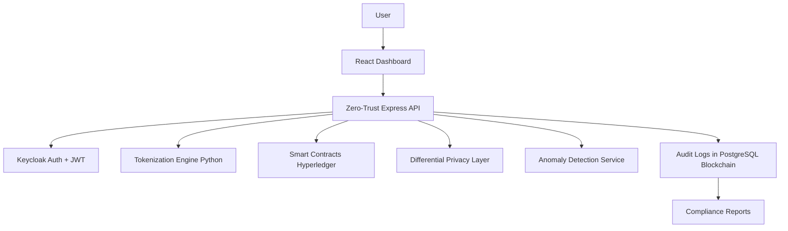

<div align="center">

# 🔐 TrustVault
## Privacy-by-Design Data Sharing Framework

[](https://canarabank.com) 
[]() 
[](LICENSE)
[]()

**🏆 Built for Canara Bank's SuRaksha Cyber Hackathon 2025**

*Empowering secure, transparent, and compliant data sharing in the fintech ecosystem*

</div>

---

## 📋 Table of Contents
- [🎯 Overview](#-overview)
- [🚀 Key Modules](#-key-modules)
- [🧠 System Architecture](#-system-architecture)
- [🛠️ Tech Stack](#️-tech-stack)
- [� Folder Structure](#-folder-structure)
- [⚙️ Setup Instructions](#️-setup-instructions)
- [� API Endpoints](#-api-endpoints)
- [�‍💻 Contributing](#-contributing)
- [🧪 Hackathon Goals Checklist](#-hackathon-goals-checklist)
- [📄 License](#-license)

---

## 🎯 Overview

**TrustVault** is a next-generation privacy-first data sharing system for fintech ecosystems. Designed to empower users and financial institutions alike, it integrates advanced privacy techniques like **tokenization**, **differential privacy**, **zero-trust APIs**, and **blockchain-based smart contracts**. Built with regulatory compliance in mind — aligned with **DPDP Act (India)** and **GDPR (EU)** — it ensures data privacy, transparency, and real-time user control.

### 💡 Why TrustVault?

| Challenge | TrustVault Solution | Business Impact |
|-----------|-------------------|-----------------|
| Data Privacy Concerns | Advanced tokenization + differential privacy | 🔒 Zero sensitive data exposure |
| Regulatory Compliance | Built-in GDPR/DPDP compliance engine | ⚖️ Automated compliance reporting |
| User Trust Issues | Transparent consent management | 👥 Enhanced customer confidence |
| Security Vulnerabilities | Zero-trust architecture + ML monitoring | 🛡️ Proactive threat detection |

---

## 🚀 Key Modules

| Module              | Description                                                                  |
| ------------------- | ---------------------------------------------------------------------------- |
| Tokenization Engine | Securely replaces sensitive data with tokens using cryptographic hashing.    |
| Privacy Layer       | Applies differential privacy to anonymize datasets while preserving utility. |
| Smart Contracts     | Enforces data-sharing agreements via permissioned blockchain (Hyperledger).  |
| Zero-Trust APIs     | Secured Express APIs with OAuth2.0 + Keycloak for role-based access.         |
| Anomaly Detection   | ML-based system (Isolation Forest) to monitor unusual access patterns.       |
| Consent Dashboard   | React-based UI for real-time consent revocation, transparency, and control.  |
| Compliance Engine   | Geo-fenced storage and auto-generated reports (DPDP/GDPR-ready).             |

---

## 🧠 System Architecture



---

## 🛠️ Tech Stack

<div align="center">

### Backend Technologies


### Frontend & UI


### Blockchain & Security


</div>

---

## 📁 Folder Structure

```
trustvault/
├── backend/
│   └── src/
│       ├── config/        # Configurations (DB, Auth, Fabric)
│       ├── controllers/   # API logic
│       ├── routes/        # API endpoints
│       ├── middleware/    # Auth, Logging, Rate Limiters
│       ├── models/        # DB Schemas
│       ├── services/      # Tokenization, Blockchain, ML
│       ├── utils/         # Helpers, validators
│       └── app.js         # App Entry Point
├── privacy-engine/        # Python services for hashing & diff privacy
├── ml-service/            # ML-based anomaly detector
├── blockchain/            # Smart contract chaincode + Fabric network
├── frontend/              # React frontend for consent control
└── README.md
```

---

## ⚙️ Setup Instructions

### 1. Clone Repository

```bash
git clone https://github.com/your-org/trustvault.git
cd trustvault
```

### 2. Start Backend (Node.js)

```bash
cd backend
npm install
cp .env.example .env
npm run dev
```

### 3. Start Privacy Engine (Python)

```bash
cd privacy-engine
pip install -r requirements.txt
python tokenizer.py
```

### 4. Start ML Anomaly Service

```bash
cd ml-service
pip install -r requirements.txt
python detector.py
```

### 5. Start Frontend

```bash
cd frontend
npm install
npm run dev
```

---

## 🔌 API Reference

### Authentication
All API requests require JWT authentication:
```bash
Authorization: Bearer <jwt-token>
```

### Core Endpoints

| Method | Endpoint | Description | Rate Limit |
|--------|----------|-------------|------------|
| `POST` | `/api/auth/login` | User authentication | 5/min |
| `GET` | `/api/consents` | Fetch user consents | 100/min |
| `POST` | `/api/tokenize` | Tokenize sensitive data | 50/min |
| `POST` | `/api/share-data` | Execute data sharing | 20/min |
| `POST` | `/api/revoke` | Revoke consent | 10/min |
| `GET` | `/api/audit-logs` | Fetch audit trail | 30/min |

### Example: Data Tokenization
```javascript
// Request
POST /api/tokenize
{
  "data": "john.doe@email.com",
  "dataType": "email",
  "purpose": "marketing-analytics",
  "retention": "30d"
}

// Response
{
  "token": "tk_7a8b9c1d2e3f4g5h",
  "expires": "2025-02-15T10:30:00Z",
  "consentId": "consent_abc123"
}
```

---

## 📊 Performance

### Benchmarks
- **Tokenization Speed**: 10,000 records/second
- **API Response Time**: < 100ms average
- **Blockchain Transaction**: < 2 seconds
- **ML Anomaly Detection**: Real-time processing

### Scalability
- **Concurrent Users**: 10,000+
- **Daily Transactions**: 1M+
- **Data Storage**: Petabyte-scale ready

---

## 🔒 Security

### Privacy Guarantees
- ✅ **ε-differential privacy** with configurable epsilon
- ✅ **Zero sensitive data** in logs or caches
- ✅ **End-to-end encryption** for data in transit
- ✅ **Hardware security modules** for key management

### Compliance Features
- 📋 **GDPR Article 17**: Right to erasure
- 📋 **DPDP Act 2023**: Data localization
- 📋 **PCI DSS**: Payment data security
- 📋 **ISO 27001**: Information security management

---

## 🤝 Contributing

We welcome contributions! Please see our [Contributing Guidelines](CONTRIBUTING.md).

### Development Workflow
1. **Fork** the repository
2. **Create** feature branch: `git checkout -b feature/amazing-feature`
3. **Commit** changes: `git commit -m 'Add amazing feature'`
4. **Push** to branch: `git push origin feature/amazing-feature`
5. **Open** a Pull Request

### Code Standards
- Follow ESLint configurations
- Write unit tests for new features
- Update documentation
- Ensure CI/CD pipeline passes

---

## 🗺️ Roadmap

### Phase 1: MVP (Current)
- [x] Core tokenization engine
- [x] Basic consent management
- [x] API authentication
- [ ] Smart contract integration
- [ ] ML anomaly detection

### Phase 2: Enhancement
- [ ] Advanced privacy techniques
- [ ] Mobile SDK
- [ ] Third-party integrations
- [ ] Advanced analytics dashboard

### Phase 3: Enterprise
- [ ] Multi-tenant architecture
- [ ] Advanced compliance reporting
- [ ] AI-powered insights
- [ ] Global deployment

---

## 📞 Support

### 🚨 Issues & Bugs
- Report issues: [GitHub Issues](https://github.com/your-org/trustvault/issues)
- Security vulnerabilities: security@trustvault.dev

### 📚 Documentation
- [API Documentation](https://docs.trustvault.dev)
- [Developer Guide](https://docs.trustvault.dev/dev-guide)
- [Deployment Guide](https://docs.trustvault.dev/deployment)

### 💬 Community
- [Discord Server](https://discord.gg/trustvault)
- [Discussion Forum](https://github.com/your-org/trustvault/discussions)

---

<div align="center">

## 🏆 Hackathon Team

**Team [nikhilprince973_9947]**

Made with 💙 for **SuRaksha Cyber Hackathon 2025**

[](https://github.com/your-org/trustvault)
[](https://opensource.org/licenses/MIT)

*Securing the future of financial data sharing*

</div>

